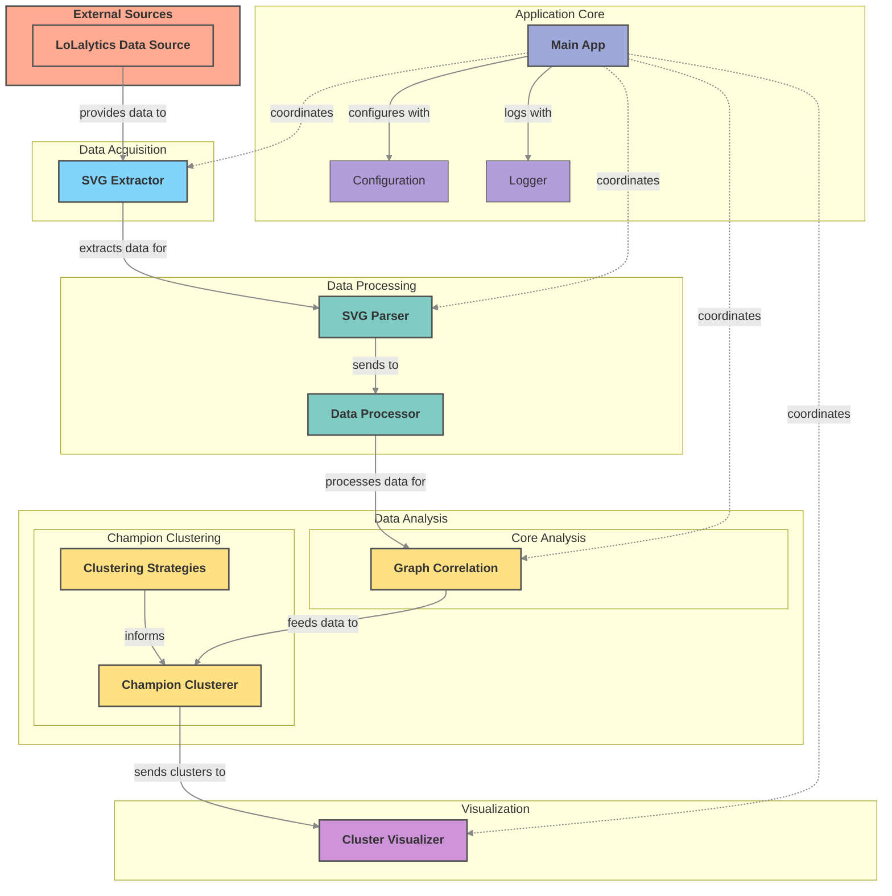

```mermaid
flowchart TB
    %% Default styling
    linkStyle default stroke:#888,stroke-width:1.5px
    
    %% Define components
    subgraph External["External Sources"]
        LoLalytics["LoLalytics Data Source"]:::external
    end

    subgraph AppCore["Application Core"]
        MainApp["Main App"]:::mainApp
        Config["Configuration"]:::config
        Logger["Logger"]:::logger
        
        MainApp --> |"configures with"| Config
        MainApp --> |"logs with"| Logger
    end

    subgraph DataAcq["Data Acquisition"]
        SVGExtractor["SVG Extractor"]:::acquisition
    end

    subgraph DataProc["Data Processing"]
        SVGParser["SVG Parser"]:::processing
        DataProcessor["Data Processor"]:::processing
        
        SVGParser --> |"sends to"| DataProcessor
    end

    subgraph DataAnalysis["Data Analysis"]
        subgraph CoreAnalysis["Core Analysis"]
            GraphCorrelation["Graph Correlation"]:::analysis
        end
        
        subgraph Clustering["Champion Clustering"]
            ClusteringStrategies["Clustering Strategies"]:::analysis
            ChampionClusterer["Champion Clusterer"]:::analysis
            
            ClusteringStrategies --> |"informs"| ChampionClusterer
        end
        
        GraphCorrelation --> |"feeds data to"| ChampionClusterer
    end

    subgraph Visualization["Visualization"]
        ClusterViz["Cluster Visualizer"]:::visualization
    end

    %% External and data flow connections
    LoLalytics -->|"provides data to"| SVGExtractor
    SVGExtractor -->|"extracts data for"| SVGParser
    DataProcessor -->|"processes data for"| GraphCorrelation
    ChampionClusterer -->|"sends clusters to"| ClusterViz

    %% Main app orchestration connections
    MainApp -.->|"coordinates"| SVGExtractor
    MainApp -.->|"coordinates"| SVGParser
    MainApp -.->|"coordinates"| GraphCorrelation
    MainApp -.->|"coordinates"| ClusterViz
    
    %% Component styling
    classDef external fill:#FFAB91,stroke:#555,stroke-width:2px,color:#333,font-weight:bold
    classDef mainApp fill:#9FA8DA,stroke:#555,stroke-width:2px,color:#333,font-weight:bold
    classDef config fill:#B39DDB,stroke:#555,stroke-width:1px,color:#333
    classDef logger fill:#B39DDB,stroke:#555,stroke-width:1px,color:#333
    classDef acquisition fill:#81D4FA,stroke:#555,stroke-width:2px,color:#333,font-weight:bold
    classDef processing fill:#80CBC4,stroke:#555,stroke-width:2px,color:#333,font-weight:bold
    classDef analysis fill:#FFE082,stroke:#555,stroke-width:2px,color:#333,font-weight:bold
    classDef visualization fill:#CE93D8,stroke:#555,stroke-width:2px,color:#333,font-weight:bold
    
    %% Class assignments
    class External external
```