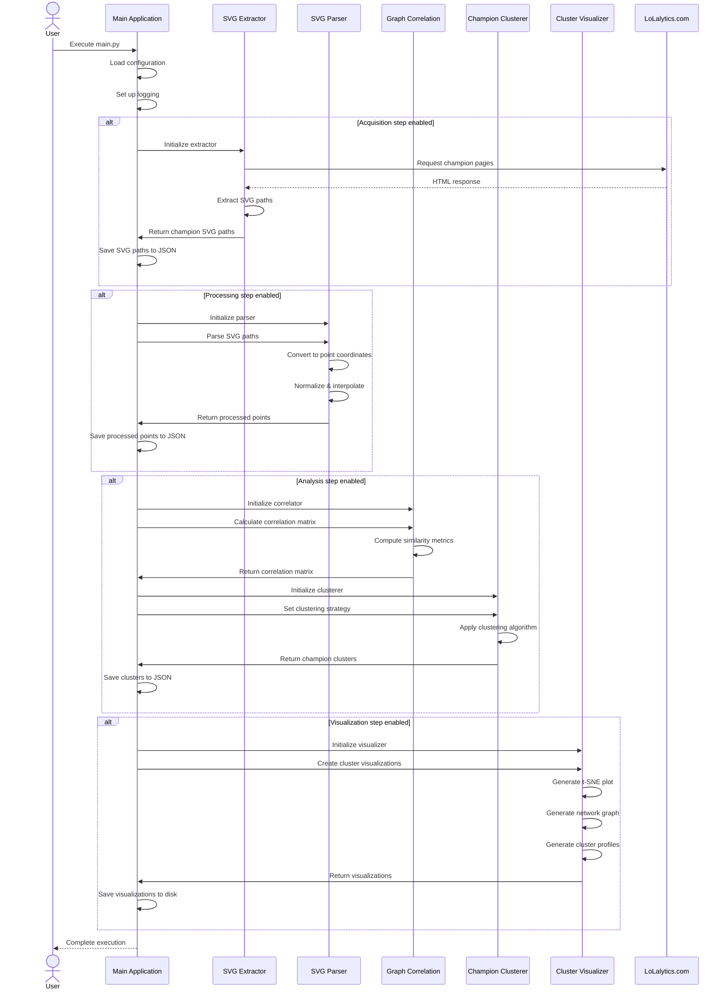

# Winrates Analysis Tool - Sequence Diagram

## Data Processing Pipeline

```mermaid
sequenceDiagram
    actor User
    participant Main as Main Application
    participant Extractor as SVG Extractor
    participant Parser as SVG Parser
    participant Correlation as Graph Correlation
    participant Clusterer as Champion Clusterer
    participant Visualizer as Cluster Visualizer
    participant LoLalytics as LoLalytics.com
    
    User->>Main: Execute main.py
    
    %% Configuration phase
    Main->>Main: Load configuration
    Main->>Main: Set up logging
    
    %% Data Acquisition
    alt Acquisition step enabled
        Main->>Extractor: Initialize extractor
        Extractor->>LoLalytics: Request champion pages
        LoLalytics-->>Extractor: HTML response
        Extractor->>Extractor: Extract SVG paths
        Extractor->>Main: Return champion SVG paths
        Main->>Main: Save SVG paths to JSON
    end
    
    %% Data Processing
    alt Processing step enabled
        Main->>Parser: Initialize parser
        Main->>Parser: Parse SVG paths
        Parser->>Parser: Convert to point coordinates
        Parser->>Parser: Normalize & interpolate
        Parser->>Main: Return processed points
        Main->>Main: Save processed points to JSON
    end
    
    %% Data Analysis
    alt Analysis step enabled
        Main->>Correlation: Initialize correlator
        Main->>Correlation: Calculate correlation matrix
        Correlation->>Correlation: Compute similarity metrics
        Correlation->>Main: Return correlation matrix
        
        Main->>Clusterer: Initialize clusterer
        Main->>Clusterer: Set clustering strategy
        Clusterer->>Clusterer: Apply clustering algorithm
        Clusterer->>Main: Return champion clusters
        Main->>Main: Save clusters to JSON
    end
    
    %% Visualization
    alt Visualization step enabled
        Main->>Visualizer: Initialize visualizer
        Main->>Visualizer: Create cluster visualizations
        Visualizer->>Visualizer: Generate t-SNE plot
        Visualizer->>Visualizer: Generate network graph
        Visualizer->>Visualizer: Generate cluster profiles
        Visualizer->>Main: Return visualizations
        Main->>Main: Save visualizations to disk
    end
    
    Main-->>User: Complete execution
```

